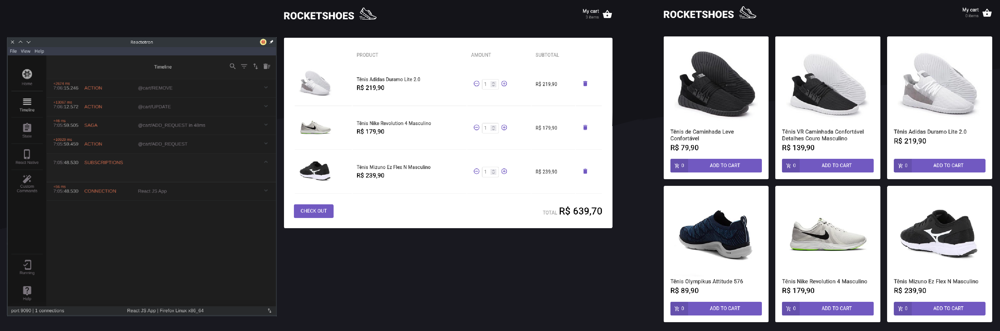

<p align="center">
  
</p>

<p align="center">
  
  
  
  
  
  
  
</p>

<p align="center">
  <a href="#-technologies">Technologies</a>&nbsp;&nbsp;&nbsp;|&nbsp;&nbsp;&nbsp;
  <a href="#-project">Project</a>&nbsp;&nbsp;&nbsp;|&nbsp;&nbsp;&nbsp;
  <a href="#-layout">Layout</a>&nbsp;&nbsp;&nbsp;|&nbsp;&nbsp;&nbsp;
  <a href="#memo-licença">License</a>
</p>

<p align="center">
  
</p>

<br>

<p align="center">
  
</p>

## 🚀 Technologies

This project was developed with the following technologies:

- HTML e CSS
- JavaScript
- React
- React Router DOM
- Styled Components
- React Icons
- Redux
- Redux Saga
- immer
- polished
- Reactotron
- ESLint
- Prettier
- json-server
- Axios
- Git e Github

## 💻 Project

This repository hosts an e-commerce application called Rocketshoes, which is a simple online store for shoes. The project is built using React and Redux for state management, and it includes features such as adding items to the cart and viewing the cart.

## 💻 How to run

```bash
# Clone the repository
git clone https://github.com/filipebteixeira98/rocketshoes.git

# Access the project folder
cd rocketshoes

# Run the backend server
npx json-server server.json -p 3333 -w
# The backend will run on http://localhost:3333

# Use previous Node.js versions due to compatibility issues with some dependencies
# Install Node.js version 16 using nvm (Node Version Manager)
nvm install 16
# Switch to version 16
nvm use 16

# Install the dependencies
yarn install
# or
yarn
# Start the frontend server
yarn start
# The frontend will run on http://localhost:3000
# Don't forget to execute Reactotron to monitor the Redux state
```

## 📝 License

This project is under the MIT license.

<p align="center">
  Made with ♥ by me
</p>
